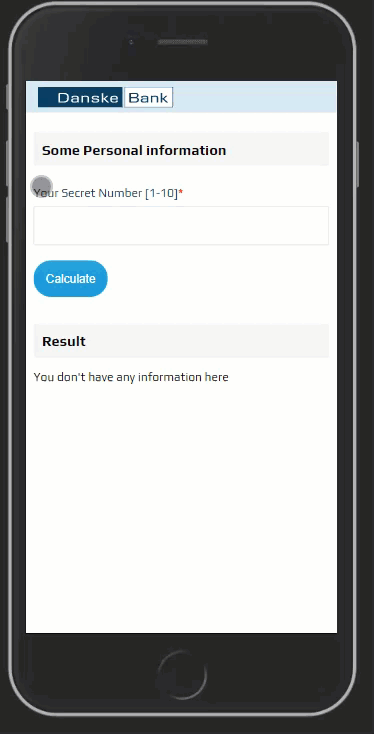

# Danskebank Code Challenge

this repository contains three sub directory

- client-react-apollo : the UI of app that created with React and Apollo Client
- graphql-server : GraphQL server 
- service-mock Express/Node js mock server

## Client React Apollo
it's run on port 3000 
for 
technologies : 
- Styled-components
- Apollo Client
- React
- React Hooks

## GraphQL Server
it's run on port 4000
technologies :
- Apollo Server
- node-fetch

## Service Mock
it's run on port 8000 
technologies
- Express JS

# How to run the project
just clone the project and then use `npm start` for client-react-apollo and use `node index` for both service-mock and graphql-server